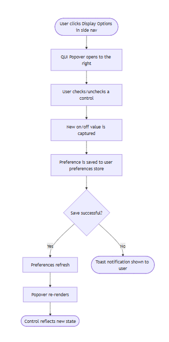
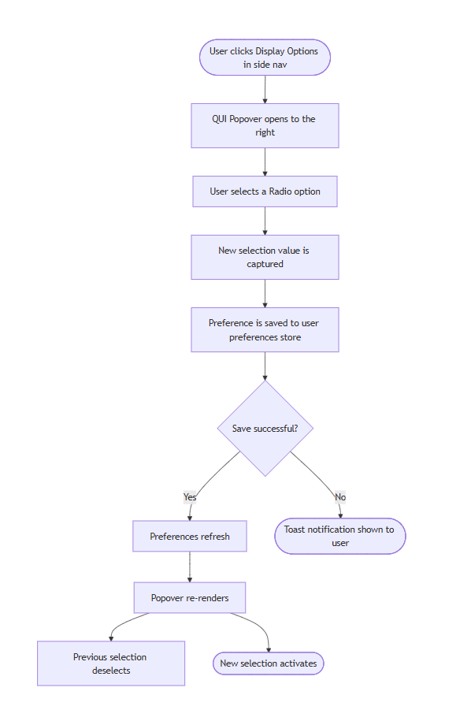
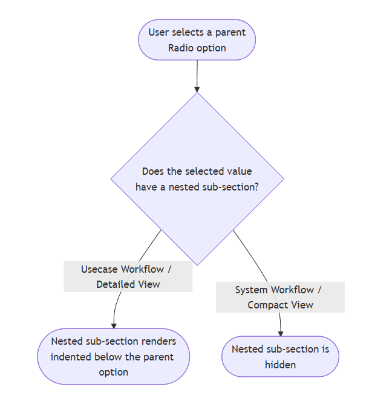
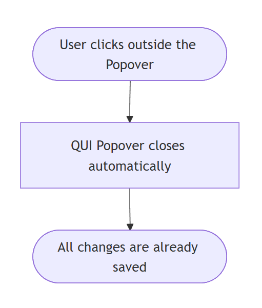
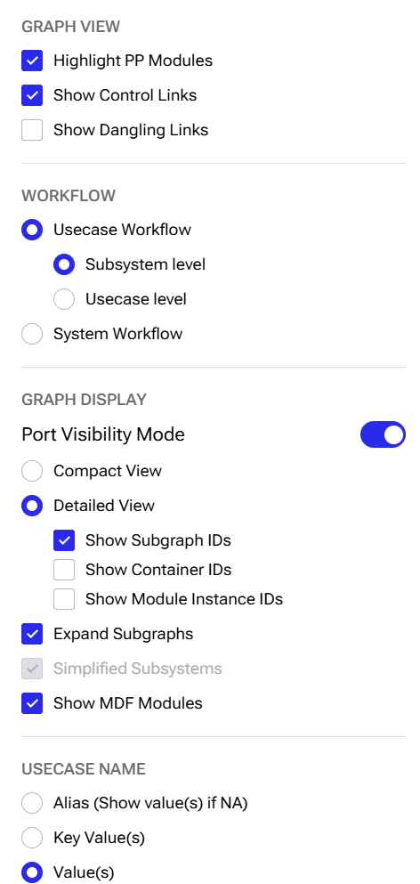

## Feature Overview and Strategic Fit
**Display Options in Side Nav:** The Graph Designer exposes a set of visualization controls — Show Control Links, Show Dangling Links, Highlight PP Modules, Expand Subgraphs, Simplified Subsystems, Show MDF Modules, Port Visibility Mode, Workflow (Usecase/System Workflow, with Subsystem/Usecase level nested under Usecase Workflow), Compact/Detailed View, and Usecase Name Preference. These controls need to be accessible to the user directly from the side nav. This feature adds a single Display Options entry to the Graph Designer side nav. Clicking it opens a QUI Popover panel containing Switch toggles, Checkboxes, and RadioGroup controls for all visualization settings. Each change writes immediately to the user preferences store, persisting the user's choices across sessions. These controls are Graph Designer-specific and do not appear in the side nav for any other tab.

---

## Architectural Impacts
*   `side-nav-types.ts` adds `import type {ReactNode} from 'react'` and adds an optional `popoverContent?: ReactNode` field to the `SideNavItem` interface to support items that open a QUI Popover instead of navigating
*   `arc-side-nav.tsx` adds a check in the leaf node renderer — if an item has `popoverContent`, it renders as a QUI Popover trigger instead of a standard nav link
*   `display-options-popover.tsx` new component containing a Switch toggle, checkboxes, and RadioGroup controls for all visualization preferences
*   `graph-designer.tsx` connects to the user preferences system and registers the Display Options item in the side nav using the `SlidersHorizontal` icon.

---

## Assumptions
*   The user preferences system already exists and can be called to read and save preferences
*   Preferences are saved using a dot-notation path format (e.g. `visualization.showControlLinks`)
*   Display Options is only shown in the Graph Designer tab
*   Preferences are saved to a config file on disk and persist between sessions
*   The QUI Popover closes automatically when the user clicks outside it
*   The Switch toggle, checkboxes, and RadioGroup controls reflect the current saved preferences and update them directly
*   Both `Usecase Workflow` and `System Workflow` radios are always visible. `Subsystem level` / `Usecase level` render as a nested sub-choice under `Usecase Workflow` and collapse away when `System Workflow` is selected

---

## Requirements
| Title | User Story | Importance | Type |
| --- | --- | --- | --- |
| Display Options entry | As a user, I want a single Display Options entry in the side nav | Must Have | Functional |
| Popover opens on click | As a user, I want to click Display Options to open a Popover | Must Have | Functional |
| Show Control Links checkbox | As a user, I want to check or uncheck Show Control Links from the Popover | Must Have | Functional |
| Show Dangling Links checkbox | As a user, I want to check or uncheck Show Dangling Links from the Popover | Must Have | Functional |
| Highlight PP Modules checkbox | As a user, I want to check or uncheck Highlight PP Modules from the Popover | Must Have | Functional |
| Expand Subgraphs checkbox | As a user, I want to check or uncheck Expand Subgraphs from the Popover | Must Have | Functional |
| Simplified Subsystems checkbox | As a user, I want to check or uncheck Simplified Subsystems from the Popover, disabled while Usecase Workflow is selected; automatically checked when System Workflow is selected | Must Have | Functional |
| Show MDF Modules checkbox | As a user, I want to check or uncheck Show MDF Modules from the Popover | Must Have | Functional |
| Port Visibility Mode toggle | As a user, I want to toggle port visibility between active and all from the Popover | Must Have | Functional |
| Compact View / Detailed View radio | As a user, I want to switch between Compact View and Detailed View from the Popover. **Compact View:** Nodes show names only — module/container/subgraph IDs are hidden for a smaller, denser, easier-to-read graph. **Detailed View:** Nodes show their full IDs (module instance, container, subgraph) alongside names, giving a complete view of each module. | Must Have | Functional |
| Workflow radio | As a user, I want to switch between Usecase Workflow and System Workflow from the Popover | Must Have | Functional |
| Usecase Name Preference radio | As a user, I want to switch between Alias, Key Value(s), and Value(s) name display from the Popover | Must Have | Functional |
| Preference persistence | As a user, I want my display choices to persist after I change them | Must Have | Functional |
| Close on outside click | As a user, I want the Popover to close when I click outside it | Must Have | Functional |
| Graph Designer scope | As a user, I only want Display Options visible when I am in the Graph Designer tab | Must Have | Functional |

---

## Flow Diagrams

**Checkbox / Control Interaction:**

**Radio Select (Compact View / Detailed View, Workflow, Usecase Name)**

**Conditional Sub-Section Reveal (Workflow level, Detailed-View IDs)**

**Close Popover**

---

## User Interaction and Design
*   A single **Display Options** entry appears in the side nav only when the Graph Designer tab is active
*   Side nav collapsed: shows `SlidersHorizontal` icon only with a tooltip reading "Display Options"
*   Side nav expanded: shows `SlidersHorizontal` icon and "Display Options" label
*   Clicking Display Options opens a QUI Popover to the right of the side nav
*   The Popover has four sections: Graph View, Workflow, Graph Display, and Usecase Name
*   Checkboxes and the Port Visibility Mode Switch toggle show the current on/off state
*   RadioGroup controls show the current selection
*   Every change writes immediately to the user preferences store
*   Clicking anywhere outside the Popover closes it

**Popover UI:**

---

## Component Design
**New file:** `display-options-popover.tsx`
A QUI Popover that opens to the right of the side nav when the user clicks Display Options. Organized into four sections:

**Graph View** — three Checkboxes:
*   Highlight PP Modules
*   Show Control Links
*   Show Dangling Links

**Workflow** — a single `RadioGroup` with `Usecase Workflow` / `System Workflow`:
*   When `Usecase Workflow` is selected, a nested `RadioGroup` (`Subsystem level` / `Usecase level`) renders indented directly beneath it
*   When `System Workflow` is selected, the nested `RadioGroup` is not rendered

**Graph Display**:
*   Port Visibility Mode — Switch toggle (on = active ports only, off = all ports)
*   Compact View / Detailed View — RadioGroup with two options
*   When Detailed View is selected: Show Subgraph IDs, Show Container IDs, Show Module Instance IDs — three additional Checkboxes, indented under the Detailed View option
*   Expand Subgraphs — Checkbox, always visible
*   Simplified Subsystems — Checkbox, disabled when Usecase Workflow is selected; automatically checked when System Workflow is selected; retains its checked/unchecked value when switching between Usecase Workflow and System Workflow
*   Show MDF Modules — Checkbox

**Usecase Name** — RadioGroup with three options:
*   Alias
*   Key Value(s)
*   Value(s)

Each control reads the current saved preference and writes back immediately when the user makes a change.

---

## Database Design
Not applicable on frontend.

---

## Error Handling
*   If a preference fails to save, a toast notification is shown to the user
*   If preferences have not loaded yet on first render, all controls fall back to their default values

---

## Security Considerations
*   No network calls are made — all preferences are stored locally in a config file on disk
*   No free-text input from the user — all values come from fixed checkboxes, Switch toggle, and RadioGroup selections

---

## Performance Considerations
*   The side nav item list is only rebuilt when the user's preferences change
*   The QUI Popover content is not loaded until the user opens it for the first time — no cost while it is closed
*   Each preference change causes one re-render of the Popover only — no unnecessary updates

---

## Testing Strategy
**Unit Tests:**
*   Popover renders all three Graph View checkboxes, all Graph Display controls, and all Radio options across the Workflow RadioGroup (and its nested sub-group), Compact/Detailed View, and the Usecase Name RadioGroup
*   Each checkbox/Switch/Radio calls `savePreference` with the correct preference path and new value on interaction
*   Each control reflects the current saved preference
*   Both `Usecase Workflow` and `System Workflow` radios are always present
*   `Subsystem level` / `Usecase level` are visible when `Usecase Workflow` is selected, hidden when `System Workflow` is selected, and reappear when switching back
*   Detailed-View-only checkboxes are hidden in Compact View and appear after switching to Detailed View
*   Simplified Subsystems is disabled when Usecase Workflow is selected
*   Simplified Subsystems is automatically checked when System Workflow is selected
*   Simplified Subsystems retains its checked/unchecked value when switching between Usecase Workflow and System Workflow — only its `disabled` state changes
*   A toast notification is shown when a preference save fails

**Integration Tests:**
*   Click Display Options → QUI Popover opens
*   Check/uncheck Show Control Links, Show MDF Modules → correct preference save triggered
*   Toggle Port Visibility Mode → correct preference save triggered
*   Select Detailed View → correct preference save triggered, ID checkboxes appear
*   Select System Workflow → correct preference save triggered, Subsystem/Usecase level radios disappear, Simplified Subsystems automatically checked
*   Select Subsystem level / Usecase level (while Usecase Workflow is active) → correct preference save triggered
*   Select Alias / Key Value(s) / Value(s) → correct preference save triggered
*   Simulate preference save failure → toast notification appears
*   Click outside Popover → Popover closes
*   Switch to a non-Graph Designer tab → Display Options is not visible
*   Switch back to Graph Designer → Display Options reappears

**End-to-End equivalent:**
*   Uncheck Show Dangling Links / Show MDF Modules → close Popover → simulate reload → verify preference still off
*   Select Detailed View → close → reopen → verify still selected
*   Select System Workflow → close → reopen → verify still selected and the nested level radios stay hidden
*   Verify only one Radio option can be active per group at a time

---

## Open-Source Libraries
*   `ConfigFileManager` — reads and writes user preferences to the user preferences store
*   React — manages Popover state and re-renders when preferences change
*   `lucide-react` — provides the `SlidersHorizontal` icon for the Display Options side nav entry
*   QUI Popover — the Popover triggered by clicking Display Options
*   QUI Switch — the Switch toggle control for Port Visibility Mode
*   QUI Checkbox — the checkbox controls for boolean preference values in Graph View and Graph Display
*   QUI Radio — the RadioGroup controls for Workflow (and its nested level sub-group), Compact/Detailed View, and Usecase Name preference selections
*   QUI Toast Notification — displays a notification when a preference fails to save
