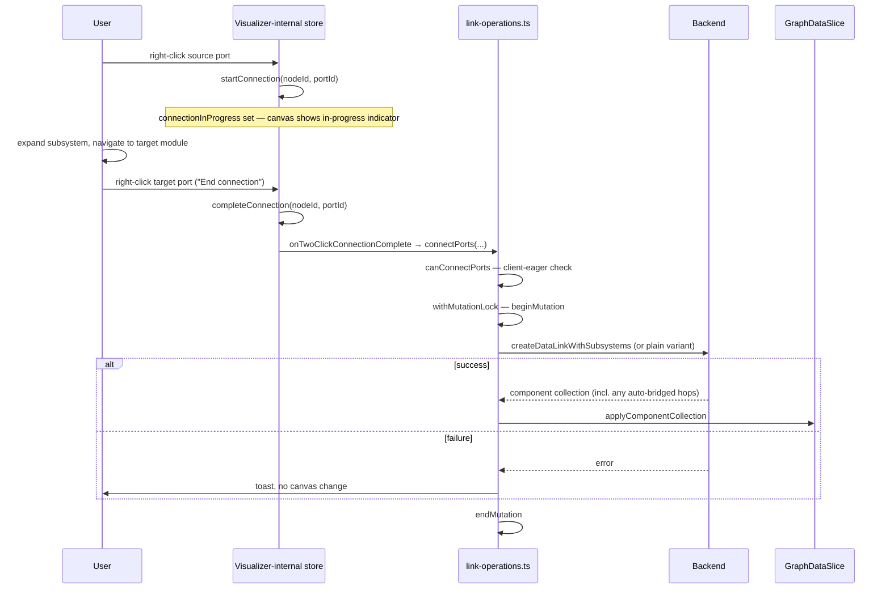
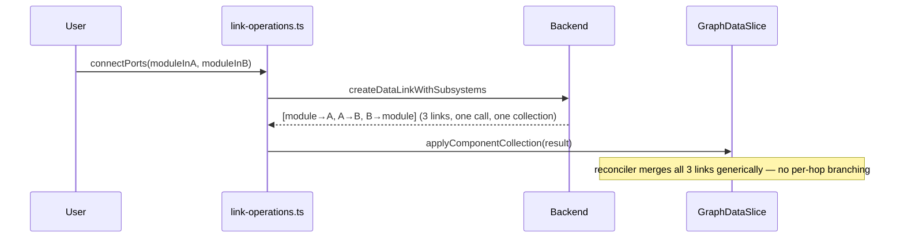

# Link & Port — Design

> Requirements: [requirements.md](requirements.md) §5, §7, §12 (FR-LINK-01–07,
> FR-PORT-01–06, FR-MDF-02 — see
> [§2.1](#21-two-entry-points-one-shared-core) for FR-LINK-01/FR-LINK-02's two
> connection-creation entry points; FR-MDF-03/DSP offload deferred,
> see [§1](#1-scope))
>
> Parent LLD: [design.md](design.md) §2, §6.1–6.3, §7 (architecture, store
> composition, response reconciliation, and API shapes this doc builds on
> without repeating)
>
> Feature path: `packages/react-app/src/features/graph-designer/lib/`
> Visualizer-internal state: `packages/react-app/src/features/usecase-visualizer/model/`
> Backend endpoints: `POST /data-links`/`/control-links` (`/with-subsystems`),
> `DELETE /data-links/{id}`/`/control-links/{id}`, port-count fields on
> `PATCH /spf-modules/{id}`/`PATCH /subsystems/{id}` — see [§6](#6-api-surface)

---

## Table of Contents

1. [Scope](#1-scope)
2. [Connection Creation](#2-connection-creation)
3. [Port Count Operations](#3-port-count-operations)
4. [Port Context Menu](#4-port-context-menu)
5. [Link Deletion](#5-link-deletion)
6. [API Surface](#6-api-surface)
7. [Sequence Diagrams](#7-sequence-diagrams)
8. [Testing Strategy](#8-testing-strategy)
9. [Open Items Inherited](#9-open-items-inherited)

---

## 1. Scope

This doc designs connection creation/deletion and port-count changes — the
mutation logic in
[design.md §6.4](design.md#64-feature-area-component-map)'s "Link & Port"
row. It owns:

- The shared validation + backend-call core both connection-creation entry
  points funnel into.
- Port-count increase/decrease.
- Link deletion.

**DSP offload (FR-MDF-03) is deferred, out of scope for this doc** — no
`offloadModuleToDsp`-equivalent endpoint exists and none is currently
planned; see
[design.md §9](design.md#9-open-questions)/[§16](design.md#16-not-doing).

It does **not** own:

- Context menu item definitions/wiring (which items appear, in what order)
  — Canvas UI Mechanics; this doc owns only the *handlers* those items
  dispatch to ([§4](#4-port-context-menu)).
- The Expanded/Virtual display-mode **rendering** transform for
  cross-DSP bridge modules (FR-MDF-02) — this doc guarantees the backend's
  full bridge-module response is reconciled into `graphData`
  ([§2.3](#23-cross-subsystem-and-cross-dsp-bridging-req-026-027-055)); how
  bridge modules are *drawn* (expanded vs. collapsed into one logical edge)
  is a rendering concern for Canvas UI Mechanics, the same category as port
  coloring.
- Node/subgraph/subsystem CRUD — Node Operations. This doc reuses Node
  Operations' `CAN_CONNECT_TO_PROXY_NODE` constant (FR-PROXY-01) rather than
  redeclaring it.

### 1.1 File and factory layout

Matches [node-operations-design.md
§2.1](node-operations-design.md#21-file-layout)/[§2.2](node-operations-design.md#22-the-mutation-wrapper-pattern):
one file, `features/graph-designer/lib/link-operations.ts`, exporting a
single factory:

```typescript
export function createLinkOperations(
  set: StoreApi<GraphDesignerStore>['setState'],
  projectId: string,
) {
  return {connectPorts, updatePortCount, deleteLink};

  async function connectPorts(
    get: () => GraphDesignerStore,
    /* §2.1's remaining params */
  ): Promise<void> { /* ... */ }

  async function updatePortCount(
    get: () => GraphDesignerStore,
    /* §3's remaining params */
  ): Promise<void> { /* ... */ }

  async function deleteLink(
    get: () => GraphDesignerStore,
    /* §5's remaining params */
  ): Promise<boolean> { /* ... */ }

  async function deleteLinkInner(
    get: () => GraphDesignerStore,
    /* §5's remaining params */
    options?: InnerActionOptions,
  ): Promise<boolean> { /* ... */ }
}
```

`connectPorts`/`deleteLink` never touch `set` — both write back exclusively
through `get().applyComponentCollection(...)` (§2.3/§5). `updatePortCount`
is the one function here with a narrow direct write (§3 step 3, onto the
returned entity's port arrays) — the same category
[design.md §6.3](design.md#63-response-reconciliation-shared-across-all-nodelinksubsystem-docs)
excludes from `applyComponentCollection` for module/subsystem rename and
port-count fields, so this factory takes `set` for that one write, the
same shape `createModuleOperations`/`createSubgraphOperations`/
`createSubsystemOperations` use — `createContainerOperations` is the one
factory with no `set`, since every Container Operations function routes
through `applyComponentCollection` with no narrow write of its own
([node-operations-design.md §5](node-operations-design.md#5-container-operations)).
`get` is a per-call parameter on every returned/inner function, not closed
over by the factory — the same shape every Node Operations factory uses,
so `deleteLinkInner` can be called directly by batch delete
([canvas-ui-mechanics-design.md §3](canvas-ui-mechanics-design.md#3-multi-select-and-batch-delete))
under its own outer lock, exactly like every other entity's `*Inner`
function. Every `get().projectId` reference in this doc's earlier
revisions was wrong — per
[node-operations-design.md §2.2](node-operations-design.md#22-the-mutation-wrapper-pattern),
`projectId` does not exist on `GraphDesignerStore` and must be read as this
factory's own closed-over parameter, exactly as `module-operations.ts`/
`subgraph-operations.ts`/`subsystem-operations.ts`/`container-operations.ts`
already do.

---

## 2. Connection Creation

### 2.1 Two entry points, one shared core

FR-LINK-01/FR-LINK-02 require **both** connection-creation methods:
drag-connect for ports both
visible in the current view (the canvas's existing native drag-to-connect
gesture — `onConnect`/`handleConnect` in `usecase-visualizer.tsx`, already
gated by `nodesConnectable={mode === 'edit'}` and covered by
`visualizer-edit-mode.test.tsx`), and two-click for a connection that must span a
navigation/expand action in between (e.g. connecting a module outside a
subsystem to a module inside a currently-collapsed one, where the target
port isn't rendered until the user expands into it — a single drag gesture
cannot span that). See [requirements.md §3.5](requirements.md#35-link-operations-data-and-control-links)
for the full text.

Both methods converge on one function, returned by
`createLinkOperations(set, projectId)` per the factory layout above:

```typescript
async function connectPorts(
  get: () => GraphDesignerStore,
  sourceNodeId: string,
  sourcePortId: string,
  targetNodeId: string,
  targetPortId: string,
): Promise<void>
```

- **Drag-connect** — `UsecaseVisualizer`'s existing `handleConnect` already
  performs its own inline type-compatibility/lock check and calls
  `eventHandlers.onEdgeConnected`. This doc wires `graph-designer.tsx`'s
  `onEdgeConnected` handler to call `connectPorts` directly with the
  payload's `sourceNodeId`/`sourcePortId`/`targetNodeId`/`targetPortId` — no
  change to `usecase-visualizer.tsx` itself.
- **Two-click** — new Visualizer-internal state (not `EditSessionSlice` —
  see [§2.2](#22-two-click-state-visualizer-internal)) tracks
  `connectionInProgress`. Right-clicking a second port while a connection is
  in progress calls `completeConnection`, which calls `connectPorts` with
  the stored source and the just-clicked target.

Because both paths call the same function, FR-LINK-05's client-eager
validation and the FR-LINK-06 backend call exist in exactly one place.

### 2.2 Two-click state (Visualizer-internal)

Per [design.md's own note](design.md#64-feature-area-component-map) and
[requirements.md's open questions](requirements.md#7-open-questions),
`connectionInProgress` deliberately lives in the Visualizer's own internal
store (`usecase-visualizer-store.ts`), outside `EditSessionSlice`/
`isMutating` — this is an existing, acknowledged design choice, not
something this doc relocates. Added to `VisualizerInternalStore`:

```typescript
connectionInProgress: {nodeId: string; portId: string} | null;
startConnection: (nodeId: string, portId: string) => void;
completeConnection: (nodeId: string, portId: string) => void; // clears state, then invokes connectPorts via eventHandlers
cancelConnection: () => void; // Escape — clears state, no API call
```

The existing Escape-key handler in `usecase-visualizer.tsx` (already
handling selection-clear) is extended with one more branch: if
`connectionInProgress !== null`, call `cancelConnection()` and return before
the selection-clear branch runs — FR-LINK-02's "no API call" requirement is
satisfied by construction, since `cancelConnection` only clears state.

`completeConnection` cannot call `connectPorts` directly (the Visualizer
feature has no access to `GraphDesignerStore` — that would violate FSD,
since `usecase-visualizer` sits below `graph-designer` in the dependency
direction). Instead, `completeConnection` invokes a new event handler,
`onTwoClickConnectionComplete?: (payload: EdgeConnectPayload) => void`,
added to `VisualizerEventHandlers` alongside the existing `onEdgeConnected`
— `graph-designer.tsx` wires both to the same `connectPorts` call.

**Same FSD boundary, second crossing — the port context menu's "End
connection" visibility.** Canvas UI Mechanics'
[`buildContextMenuConfig`](canvas-ui-mechanics-design.md#2-context-menu)
closes only over `get: () => GraphDesignerStore` — it has no access to
`VisualizerInternalStore`, for the same reason `completeConnection` above
can't call `connectPorts` directly. So `getItems` cannot read
`connectionInProgress` itself to decide whether "End connection" should
appear for a `'port'` target. Resolved by adding the field directly to the
target payload instead of reaching into the Visualizer's store:

```typescript
export type ContextMenuTarget =
  | ...
  | {connectionInProgress: boolean; kind: 'port'; nodeId: string; port: Port}
  | ...;
```

`usecase-visualizer.tsx`'s own `handleNodeContextMenu` (which already owns
`store` and already builds the `{kind: 'port', ...}` target at its one call
site) sets `connectionInProgress: store.getState().connectionInProgress !== null`
when constructing the target — no new prop, no store reference threaded
outward; the Visualizer answers the question about its own state before
handing the target to `getItems`. Canvas UI Mechanics'
`getItems(target: ContextMenuTarget)` then reads
`target.connectionInProgress` directly, the same as any other field on the
target union.

### 2.3 Cross-subsystem and cross-DSP bridging (FR-LINK-03, FR-LINK-04, FR-MDF-02)

`connectPorts` body:

0. **Redraw-over-excluded-link short-circuit (FR-SG-04a):** before any
   validation, check `excludedLinks` for an entry whose
   `fromPortId`/`toPortId` pair exactly matches
   `sourcePortId`/`targetPortId` — i.e. the user is redrawing the same
   connection, not its reverse. On a match, call Node Operations'
   `reincludeLink(get, connectionId)`
   ([node-operations-design.md §4.3](node-operations-design.md#43-exclude--re-include-fr-sg-03-fr-sg-04-fr-sg-04a))
   and return — **no backend call**, since the connection already exists in
   the backend and is merely being restored to canvas/routing. Steps 1–7
   below only run when there is no matching excluded link.
1. **Client-eager validation (FR-LINK-05, FR-PROXY-01):**
   `canConnectPorts(sourcePort, targetPort): boolean` — port-type match
   (data↔data, control↔control) and rejects any pairing where either port
   belongs to a subgraph-proxy node, reusing Node Operations'
   `CAN_CONNECT_TO_PROXY_NODE` constant. Fails **silently** (no toast) — a
   mismatch reaching this function means the UI already should have
   prevented the gesture (locked port, mismatched handle color for
   drag-connect; the port context menu wouldn't offer "End connection" on
   an incompatible port for two-click), so this is a defensive check, not
   a user-facing failure path.
2. **Endpoint variant selection (FR-LINK-03):** if either `sourceNodeId` or
   `targetNodeId` resolves to a `SubsystemNode` in `graphData.subsystems`,
   use `createDataLinkWithSubsystems`/`createControlLinkWithSubsystems`
   (`/data-links/with-subsystems`, `/control-links/with-subsystems`);
   otherwise the plain `createDataLink`/`createControlLink`
   (`/data-links`, `/control-links`). All four return a single flat
   `ComponentCollectionDto`/`ComponentCollectionWithSubsystemsDto` — not an
   added/updated/deleted triple — per
   [design.md §7.1](design.md#71-confirmed-endpoints).
3. `withMutationLock(get, async () => {...})` wraps steps 4–6.
4. Backend call with the resolved endpoint.
5. On success: `get().applyComponentCollection(result.data)`. **This is
   what makes FR-LINK-04's cross-subsystem auto-bridging work with no special
   frontend logic**: when the user connects a module inside Subsystem A to
   a module inside Subsystem B, the backend's response already contains
   every intermediate hop (module→A, A→B, B→module) as ordinary entries in
   the one returned collection. The existing reconciler merges an
   arbitrary number of new links from one collection with no
   per-hop-count branching — the "auto-bridging" is entirely a
   backend response-shape property this doc's reconciliation call already
   handles generically.
6. **Post-hoc control-port warning (FR-LINK-05):** after step 5's
   reconciliation, if `edgeKind === 'control'`, read the target port's
   post-merge `totalLinksAtPort` from `get().graphData` and compare to its
   `maxConnections` (from the `Port` type,
   `entities/graph/model/graph.types.ts`, already declares this field). If
   `totalLinksAtPort > maxConnections`, `showToast(...)` with severity
   `'warning'` — non-blocking; the connection is not undone. Data ports
   never run this check.
7. On failure (FR-LINK-06): toast, no state change.

**FR-MDF-02 (Expanded/Virtual display modes)** applies to the same bridge
modules step 5 already reconciled into `graphData` — this doc's
responsibility ends at "the bridge modules and links exist in `graphData`,
correctly." Whether they render as explicit nodes or collapse into one
visual edge is `VisualizationPreferences.crossDspConnectionView` (per
[design.md §8](design.md#8-database-design)), read and applied by Canvas UI
Mechanics' `level-view-adapter.ts` — not this doc.

---

## 3. Port Count Operations

`updatePortCount(get, nodeId, nodeKind: 'module' | 'subsystem', portType: 'data' | 'control', portIoType: 'input' | 'output', targetCount: number)`
(FR-PORT-01–05):

`portIoType` disambiguates which backend field a `'data'` change targets —
`maxInputPortsSupported`/`maxInputDataPortsSupported` for `'input'`,
`maxOutputPortsSupported`/`maxOutputDataPortsSupported` for `'output'` —
since data ports have separate input/output counts
([entities/graph's `PortIoType`](../../../packages/react-app/src/entities/graph/model/graph.types.ts),
`'input' | 'output' | 'control'`). Required whenever `portType === 'data'`;
the properties panel's separate input-count and output-count +/- controls
each call `updatePortCount` with their own `portIoType`, so a single call
never changes both directions at once. For `portType === 'control'`,
`portIoType` is `undefined` and ignored — `maxControlPortsSupported` is one
field with no direction split, per
[design.md §7.1](design.md#71-confirmed-endpoints)'s `PatchSpfModuleRequestDto`/`PatchSubsystemRequestDto`
shapes.

1. `withMutationLock` wraps the call.
2. Backend call: for a module, `PATCH /spf-modules/{id}` with exactly one
   of `{maxInputPortsSupported}`/`{maxOutputPortsSupported}` (portType
   `'data'`) or `{maxControlPortsSupported}` (portType `'control'`); for a
   subsystem, `PATCH /subsystems/{id}` with the equivalent
   `maxInputDataPortsSupported`/`maxOutputDataPortsSupported`/
   `maxControlPortsSupported` field — per
   [design.md §7.3](design.md#73-non-cascading-narrow-response-endpoints).
   The field sent carries `targetCount`, a **target count**, not a delta —
   the API adds/removes port entities to reach the given count. Response
   is the full updated `SpfModuleDto`/`SubsystemDto`.
3. On success: narrow direct write of the returned entity's port arrays
   (`inputPorts`/`outputPorts` for a module, `dataPorts`/`controlPorts` for
   a subsystem) onto `GraphDataSlice`, via this file's own closed-over
   `set` (per the factory in [§1.1](#11-file-and-factory-layout) — the
   same narrow-write
   mechanism [node-operations-design.md
   §2.4](node-operations-design.md#24-narrow-direct-writes-closed-over-by-each-operations-factory)
   uses for renames). Any port present in the response but
   not previously known (a genuinely new port from an increase) gets
   `totalLinksAtPort: 0` — it cannot have existing links.
4. On failure (FR-PORT-03 — backend rejects a decrease): toast, no change.

**Flagged, not resolved** (carried from
[design.md §9](design.md#9-open-questions)): whether a decrease can
cascade to sever the port's existing links is unconfirmed. The full
`SpfModuleDto`/`SubsystemDto` response above has no dedicated field to
carry severed links if the backend does this — a client-side before/after
diff of the port's connections would be needed to detect it. This doc's
implementation assumes the response holds no such side effect and does
not build a contingency path preemptively (**YAGNI** — building it now
means guessing at a link-severance response shape the backend hasn't
specified).

---

## 4. Port Context Menu

FR-PORT-06's menu items ("Start connection" / "End connection") are defined
and wired by Canvas UI Mechanics' context-menu configuration — this doc
owns only the two handlers those items dispatch to:

- `"Start connection"` → Visualizer-internal `startConnection(nodeId, portId)`.
- `"End connection"` → Visualizer-internal `completeConnection(nodeId, portId)`,
  which invokes `connectPorts` via `onTwoClickConnectionComplete`
  ([§2.2](#22-two-click-state-visualizer-internal)). Canvas UI Mechanics'
  menu-item-visibility logic (showing "End connection" only when
  `target.connectionInProgress` is `true`) reads a plain field on the
  `ContextMenuTarget` the Visualizer itself populates
  ([§2.2](#22-two-click-state-visualizer-internal)) — not a direct read of
  `VisualizerInternalStore`, which Canvas UI Mechanics has no access to.

---

## 5. Link Deletion

`deleteLink(get, connectionId, linkType: 'data' | 'control')` (FR-LINK-07):

Per [design.md §7.1](design.md#71-confirmed-endpoints), `DELETE
/data-links/{id}`/`/control-links/{id}` return **the deleted link's own
DTO**, not a full component collection — this doc wraps that single DTO
into the "deleted" bucket of an otherwise-empty `ComponentCollectionDto`
and passes it to `get().applyComponentCollection(...)`, the same
reconciliation call every other cascading action in this feature uses (see
[node-operations-design.md §3.3](node-operations-design.md#33-delete-fr-mod-05-fr-mod-06)
for the identical wrap-and-reconcile treatment on module delete). Same
lock-free-`Inner`-plus-wrapper split
as every delete action in
[node-operations-design.md §2.2](node-operations-design.md#22-the-mutation-wrapper-pattern) —
`deleteLinkInner` returns `Promise<boolean>`, accepts the same
`options?: InnerActionOptions` toast-suppression parameter every other
`*Inner` function does (
[node-operations-design.md §2.2](node-operations-design.md#22-the-mutation-wrapper-pattern)),
and is what batch delete
([canvas-ui-mechanics-design.md §3](canvas-ui-mechanics-design.md#3-multi-select-and-batch-delete))
calls directly under its own single outer lock:

```typescript
async function deleteLinkInner(
  get: () => GraphDesignerStore,
  connectionId: string,
  linkType: 'data' | 'control',
  options?: InnerActionOptions,
): Promise<boolean> {
  const result = await (linkType === 'data' ? deleteDataLink : deleteControlLink)(
    projectId,
    connectionId,
  );
  if (!result.success) {
    if (!options?.suppressToast) {
      showToast(result.message ?? 'Failed to delete connection', 'danger');
    }
    return false;
  }
  get().applyComponentCollection({
    added: EMPTY_COLLECTION,
    updated: EMPTY_COLLECTION,
    deleted: {
      spfModules: [],
      dataLinks: linkType === 'data' ? [result.data] : [],
      controlLinks: linkType === 'control' ? [result.data] : [],
    },
  });
  return true;
}

async function deleteLink(
  get: () => GraphDesignerStore,
  connectionId: string,
  linkType: 'data' | 'control',
): Promise<boolean> {
  return withMutationLock(get, () => deleteLinkInner(get, connectionId, linkType));
}
```

`EMPTY_COLLECTION` here is the same `{spfModules: [], dataLinks: [],
controlLinks: []}` literal `module-operations.ts` defines
([node-operations-design.md §3.2](node-operations-design.md#32-add-fr-mod-01-fr-mod-03-fr-mod-04)) —
this file inlines its own local copy rather than importing across
operations files, the same choice `subgraph-operations.ts`'s
`deleteSubgraphInner` makes for the same literal.

Context menu item and Delete-key dispatch to `deleteLink` are Canvas UI
Mechanics' concern, same split as [§4](#4-port-context-menu).

---

## 6. API Surface

New additions to `entities/usecases/api/usecases-api.ts`, except
`patchSpfModule` (row 7 below) which lives in
`entities/spf-modules/api/spf-modules-api.ts` — already implemented by
[node-operations-design.md §3.4](node-operations-design.md#34-rename-fr-mod-07),
reused here unchanged for its port-count fields. All confirmed
against the current backend swagger, per
[design.md §7.1](design.md#71-confirmed-endpoints)/[§7.3](design.md#73-non-cascading-narrow-response-endpoints).

| Function | Method | Path | Request | Response |
| --- | --- | --- | --- | --- |
| `createDataLink` | POST | `/data-links` | `CreateDataLinkRequest` | `ComponentCollectionDto` |
| `createControlLink` | POST | `/control-links` | `CreateControlLinkRequest` | `ComponentCollectionDto` |
| `createDataLinkWithSubsystems` | POST | `/data-links/with-subsystems` | `CreateDataLinkRequest` | `ComponentCollectionWithSubsystemsDto` |
| `createControlLinkWithSubsystems` | POST | `/control-links/with-subsystems` | `CreateControlLinkRequest` | `ComponentCollectionWithSubsystemsDto` |
| `deleteDataLink` | DELETE | `/data-links/{dataLinkSystemId}` | — | Deleted link's own DTO |
| `deleteControlLink` | DELETE | `/control-links/{controlLinkSystemId}` | — | Deleted link's own DTO |
| `patchSpfModule` (port-count fields) | PATCH | `/spf-modules/{id}` | `{maxInputPortsSupported?, maxOutputPortsSupported?, maxControlPortsSupported?}` | `SpfModuleDto` |
| `patchSubsystem` (port-count fields) | PATCH | `/subsystems/{id}` | `{maxInputDataPortsSupported?, maxOutputDataPortsSupported?, maxControlPortsSupported?}` | `SubsystemDto` |

### 6.1 Request shape (data links)

`CreateDataLinkRequest` — every field is a **systemId string**, and the four
endpoint fields are required:

```typescript
interface CreateDataLinkRequest {
  destinationNodeSystemId: string;
  destinationPortSystemId: string;
  sourceNodeSystemId: string;
  sourcePortSystemId: string;
  /** Defaults to 'normal' server-side when omitted. */
  type?: 'EC' | 'interUsecase' | 'normal';
}
```

---

## 7. Sequence Diagrams

### Sequence: Two-Click Connection Into a Collapsed Subsystem (FR-LINK-01)



### Sequence: Cross-Subsystem Connect With Auto-Bridging (FR-LINK-04)



---

## 8. Testing Strategy

Extends [design.md §14](design.md#14-testing-strategy) with cases specific
to this doc:

- **Unit — `canConnectPorts`**: data↔data allowed, control↔control allowed,
  data↔control rejected, either-side-proxy-node rejected (reusing Node
  Operations' constant), locked-port rejected.
- **Unit — convergence**: both `onEdgeConnected` (drag path) and
  `onTwoClickConnectionComplete` (two-click path) call `connectPorts` with
  equivalent arguments and produce identical reconciliation — asserted by a
  shared test helper invoked from both paths' test cases.
- **Unit — endpoint selection**: module↔module uses the plain endpoint;
  module↔subsystem-port and subsystem↔subsystem use the `-with-subsystems`
  variant.
- **Unit — control-port warning**: `totalLinksAtPort > maxConnections`
  triggers a warning toast only when `edgeKind === 'control'`; the
  identical over-limit condition on a data port triggers nothing.
- **Unit — Escape cancels two-click, no API call**: `cancelConnection`
  clears `connectionInProgress` and no `connectPorts` call is made,
  distinguishing this from the Delete-key/selection-clear branches already
  covered by existing Visualizer tests.
- **Unit — port count narrow write**: an increase's new port defaults
  `totalLinksAtPort: 0`; a decrease's rejected response leaves the port
  array unchanged.
- **Unit — `portIoType` field selection**: `portType: 'data'` with
  `portIoType: 'input'` sends only the input field
  (`maxInputPortsSupported`/`maxInputDataPortsSupported`), `'output'` sends
  only the output field, and `portType: 'control'` sends
  `maxControlPortsSupported` regardless of `portIoType`.
- **Integration**: full `connectPorts` round-trip against a mocked
  three-link auto-bridging response, asserting all three links land in
  `graphData.connections`.

---

## 9. Open Items Inherited

Carried from [design.md §9](design.md#9-open-questions), unresolved by
this doc:

- Whether a port-count decrease cascades to sever links — flagged
  in [§3](#3-port-count-operations); no contingency path built
  preemptively.
- **Connection-in-progress vs. concurrent mutation** — starting a two-click
  connection from a port, then deleting that port's owning module (or an
  ancestor) before completing it, is not designed around; expected to
  self-resolve via FR-LINK-06's standard rejection/no-valid-target path.
